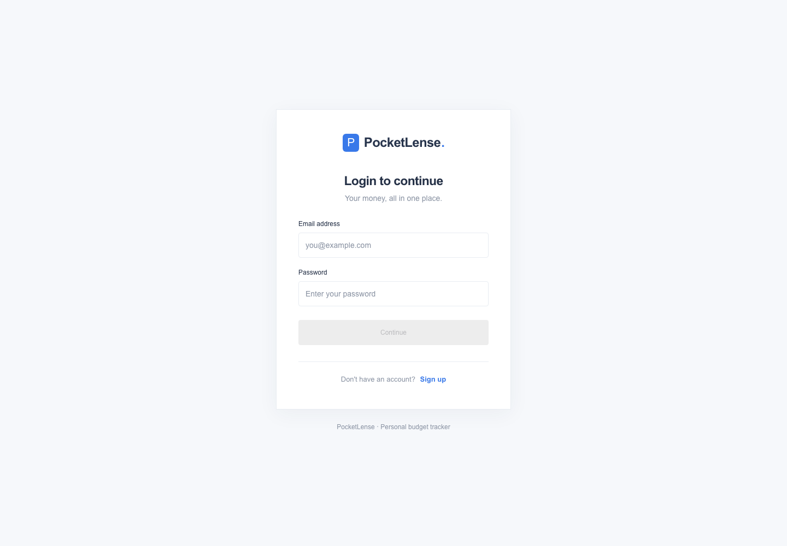
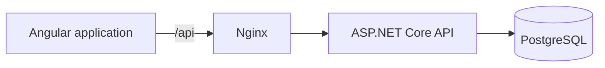

# PocketLense

[](https://github.com/bradhak5-ASU/PocketLense/actions/workflows/ci.yml)

PocketLense is a full-stack personal budgeting application built with Angular, ASP.NET Core, C#, and PostgreSQL. It helps users import bank statements, organize transactions, set monthly budgets, and review recurring charges from one dashboard.



## Features

- Secure registration and JWT login
- Dashboard with spending, income, budget, and subscription summaries
- Manual transaction entry with accounts, categories, and rules
- CSV, Excel, and text-based PDF statement imports
- Monthly budgets with warning and over-budget states
- Recurring charge detection and renewal tracking
- Light, Night Blue, and Lights Out themes
- Responsive layout and a refresh control on every signed-in page
- Read-only budgeting chat preview; external AI integration is planned

## Technology

| Area | Technology |
| --- | --- |
| Frontend | Angular, Angular Material, Chart.js |
| Backend | ASP.NET Core Web API, C# |
| Data | Entity Framework Core, PostgreSQL |
| Authentication | ASP.NET Core Identity, JWT |
| Testing | xUnit, WebApplicationFactory, Testcontainers |
| Runtime | Docker, Docker Compose, Nginx |

## Architecture



The frontend and backend build as separate containers. Nginx serves the Angular application and forwards `/api` requests to ASP.NET Core. PostgreSQL is available only inside the Docker network.

## Run with Docker

Requirements: Docker Desktop with Docker Compose.

1. Create the local environment file:

```sh
cp .env.example .env
```

2. Replace both placeholder values in `.env`. The JWT signing key must contain at least 32 characters.

3. Build and start PocketLense:

```sh
docker compose up --build
```

Open [http://127.0.0.1:4200](http://127.0.0.1:4200) and create an account. The API is also available locally on port `5080`. Database migrations run automatically when the backend container starts.

Stop the application with:

```sh
docker compose down
```

Add `--volumes` only when you also want to delete the local database data.

## Local development

Requirements: .NET 10 SDK, Node.js 22.22.3+, npm, and Docker Desktop.

Store development credentials outside the repository:

```sh
dotnet user-secrets set "ConnectionStrings:Default" "Host=localhost;Port=5437;Database=pocketlense;Username=pocketlense;Password=YOUR_LOCAL_PASSWORD" --project backend/PocketLense.Api
dotnet user-secrets set "Jwt:SigningKey" "YOUR_RANDOM_KEY_AT_LEAST_32_BYTES" --project backend/PocketLense.Api
```

Start PostgreSQL, apply the migrations, and run the API:

```sh
docker compose up -d database
dotnet tool restore
dotnet ef database update --project backend/PocketLense.Infrastructure --startup-project backend/PocketLense.Api
dotnet run --project backend/PocketLense.Api
```

In another terminal:

```sh
cd frontend
npm ci
npm start
```

Angular runs at `http://127.0.0.1:4200` and forwards development API requests to port `5080`.

## Project structure

```text
PocketLense/
├── backend/
│   ├── PocketLense.Api/             Controllers, authentication, and API setup
│   ├── PocketLense.Core/            Models and budgeting rules
│   ├── PocketLense.Infrastructure/  PostgreSQL, imports, reports, and migrations
│   └── Dockerfile
├── frontend/                         Angular application and Nginx configuration
├── tests/                            Unit and PostgreSQL integration tests
├── .github/workflows/ci.yml          Build and test workflow
├── docker-compose.yml
└── PROJECT_SPEC.md
```

The backend dependency direction is `Api → Infrastructure → Core`. Angular HTML, CSS, and TypeScript remain in separate files.

## Tests and checks

```sh
dotnet test
cd frontend
npm run build
cd ..
docker compose build
```

Integration tests use a temporary PostgreSQL container. GitHub Actions runs the backend tests, frontend production build, and Docker image builds for every pull request and push to `main`.

## Statement import notes

- CSV and Excel files display a preview for column matching before import.
- Text-based PDFs are scanned for rows that begin with a complete date and end with an amount.
- Scanned or password-protected PDFs require OCR and are rejected with a clear message.
- Imports are all-or-nothing when parsing fails, and repeated statement rows are detected.

## Security

- Every user-owned database query is filtered by the authenticated user ID.
- PostgreSQL binds only to the local computer in development and is not exposed to the wider network.
- JWT sessions expire after one hour, and authentication endpoints are rate limited.
- `.env`, local login files, certificates, database dumps, and .NET user secrets are excluded from Git.
- The budgeting chat preview uses local rules. No financial data is sent to an external AI service.

## Current scope

PocketLense currently supports USD. Refresh tokens, password reset, bank connections, email sync, OCR, deployment, and external AI integration are planned improvements.

See [PROJECT_SPEC.md](PROJECT_SPEC.md) for detailed behavior and product decisions.
